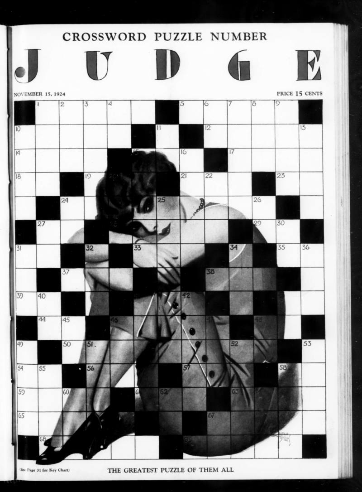
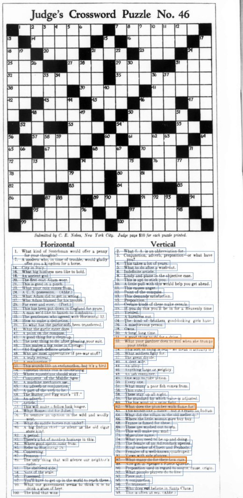
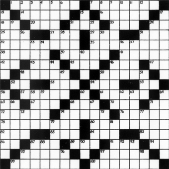
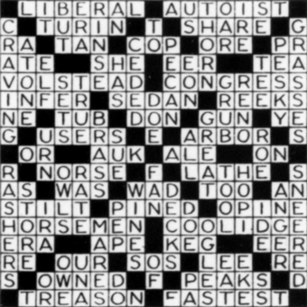
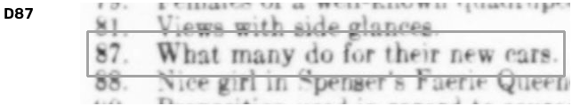
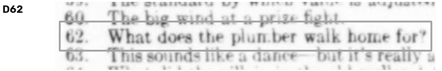
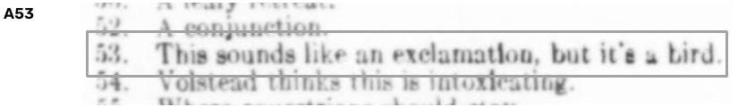
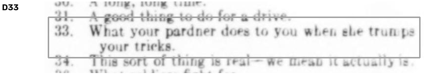

# Every Puzzle Project: puzzle review

**Have Claude usage left before your weekly reset? Spend it restoring
crosswords that haven't been solved in nearly a hundred years.**



Already convinced? [Here's the prompt to paste.](#how-to-help)

## The goal

[The first crossword puzzle](https://en.wikipedia.org/wiki/Arthur_Wynne)
appeared in print in 1913. Most of the crosswords printed before the 1940s
survive only as pictures: page scans of old magazines and newspapers. You
can look at them, but you can't search them, count them, or compare them.

The Every Puzzle Project is turning those scans into
[xd files](https://github.com/century-arcade/xdformat), a plain-text crossword format
with the grid, every clue and answer, the title, the author and the date. In
xd, a 1929 puzzle sits in the same open archive as modern ones and can be
searched and analyzed with them. You can ask which words were crossword
staples a century ago, how cluing changed, or who the forgotten constructors
were. Many of them were readers who mailed puzzles in. Analysis of the xd
archive has already turned up
[a major crossword plagiarism case](https://web.archive.org/web/20161231234043/http://fivethirtyeight.com/features/a-plagiarism-scandal-is-unfolding-in-the-crossword-world/)
(FiveThirtyEight, 2016).

## What's done, and what's left

**Done, by machine.** We found the puzzles in scanned magazines, cut out
each grid, clue list and answer key, and read them all with OCR (text
recognition) built for this project and tuned for 1920s crossword pages. The answer
keys were often printed weeks later in another issue. Every puzzle now has a
first-draft transcription.

**Left: checking it against the scan.** OCR is close but not right. It
reads `rn` as `m`, misses a black square, drops a clue's last word at a line
break, or picks up a stray caption from the next column. One error is enough
to ruin a crossword, and there are hundreds of puzzles to check. This is
the step your Claude does.

For each puzzle, your Claude:
- looks at the scan crops of the grid, every clue and the answer key,
- compares them, square by square and clue by clue, with the OCR's reading,
- writes down each correction, and keeps the printed misprints as printed
  (we restore what was published, not what was meant),
- says whether the puzzle is ready or what a person still needs to look at.

The result is one small JSON file per puzzle. Your Claude submits it to
the project as a pull request in your name, and a person spot-checks it
before it's merged and the puzzle goes into the archive.

## How it works: one puzzle, start to finish

Here's *Judge's* Crossword Puzzle No. 46, from April 7, 1928, submitted by
a reader, C. E. Nobes of New York City.



**1. Find the puzzle.** The pipeline searches the scanned magazine for
crossword grids, then finds the clue lists that go with each one. Every blue
box on the right is one clue it found on this page.

**2. Find the answers.** *Judge* printed the answer key the following week,
so the pipeline looks for it in later issues and matches it to this grid.
Both grids are straightened so each square can be read.

<p>


</p>

**3. Read it all with the project's OCR.** That gives a first draft: 112 clues and a
17×17 grid of letters. Most of it is right, but 1920s magazine type, uneven
ink and page curl trip OCR up. In this answer key, one square couldn't be
read at all and another was misread, and 17 clues had mistakes.

<br clear="right">

**4. Claude checks it against the scan.** This is the step volunteers run.
Claude gets the grid, the answer key, the whole page, and a strip for every
clue: the clue's label, a box around the text OCR read, and a line above and
below for context. These four strips are the orange boxes on the page:



> OCR read: What many do for their new **ears**.<br>
> Claude: What many do for their new **cars**.



> OCR read: What does the **plun.ber** walk home for?<br>
> Claude: What does the **plumber** walk home for?



> OCR read: This sounds like an **exelamatlon**, but **it'e** a bird.<br>
> Claude: This sounds like an **exclamation**, but **it's** a bird. *(AUK)*



> OCR read: What your pardner does to you when she **truwps** your tricks.<br>
> Claude: What your pardner does to you when she **trumps** your tricks.

Claude also uses the answers as a cross-check. Each answer has to fit its
clue, and each clue has to fit the grid. That catches errors no single
strip would show. "Pardner" stays as printed: Claude fixes OCR misreadings,
never the magazine. If the magazine itself made a mistake, Claude keeps it
and notes what was meant.

**5. Claude writes down what it found.** One small file per puzzle:

```json
{
  "ready": true,
  "corrections": {
    "cell:r9c6": "A",
    "cell:r16c17": "D",
    "clue:D62": "What does the plumber walk home for?",
    "clue:D87": "What many do for their new cars.",
    "…": "20 corrections in all"
  },
  "sic": {},
  "unsure": {}
}
```

**6. The result.** The corrections are applied, a person spot-checks
anything Claude flagged, and the puzzle becomes an xd file: plain text that
anyone can search, diff, or load into a solver.

```
Title: Judge's Crossword Puzzle No. 46
Author: C. E. Nobes
Date: 1928-04-07

#LIBERAL#AUTOIST#
C#TURIN#T#SHARE#G
RA#TAN#COP#ORE#PR
…

A1. What kind of Scotchman would offer a penny for your thoughts? ~ LIBERAL
A7. A modern who, in time of trouble, would gladly offer you a kingdom for a horse. ~ AUTOIST
…
```

[Solve No. 46 yourself.](https://everypuzzleproject.github.io/puzzle-review/solve.html?p=judge/judge1928-04-07)

## How to help

You need [Claude Code](https://claude.com/claude-code) and a GitHub account.
In an empty folder, start Claude Code and paste:

> Help the Every Puzzle Project restore old crosswords. Follow
> https://github.com/EveryPuzzleProject/puzzle-review/blob/main/VOLUNTEER.md
> and review **3** puzzles.

Change the 3 to whatever you like. Claude will:

1. Set up the GitHub CLI if you don't have it, and fork this repository.
2. Claim the next puzzles nobody is working on, by opening a draft pull
   request.
3. Download each puzzle's scan crops (about 3 MB) and review them, a few at
   a time.
4. Push each review to your pull request as it finishes, and give you a
   link to **solve the puzzle you just restored**.

**What it costs.** About 80k tokens a puzzle, nearly all of it Claude
reading images. If you're not sure how that compares to your plan, do 1 and
watch how far your usage meter moves. The strongest model you have does the
best job, but any recent Claude helps.

**You can stop any time.** Every finished puzzle has already been sent, so
stopping Claude, or running into your usage limit, wastes nothing. Puzzles
you claimed but didn't finish go back to the pool after 48 hours.

**What it touches.** A folder on your machine with this repository and the
puzzle images, a fork in your GitHub account, and one pull request here.
Nothing else.

## What you get

- A link to solve each puzzle you restored, right in your browser: the grid
  and clues as printed in 1929 or 1930, with a check button.
- If you'd like, your GitHub name on the
  [contributors list](https://everypuzzleproject.github.io/puzzle-review/).
  Claude will ask, and the default is no. Your pull request is public on
  GitHub either way.
- Knowing these puzzles are searchable again.

## Publications

Volunteers work through these in order:

| Publication | Years | Notes |
|---|---|---|
| [*Judge*](publications/judge/) | 1924–1939 scanned | A humor magazine with a crossword from 1924: weekly, then monthly from August 1932, often two a month. Late 1928 through 1930 open now. |

## Layout

- `VOLUNTEER.md`: the procedure Claude follows.
- `publications/<pub>/INSTRUCTIONS.md`: how to review that publication's puzzles.
- `publications/<pub>/puzzles.tsv`: every puzzle, its state (restored, needs a person, open, not open yet, missing) and where its packet is.
- `publications/<pub>/xd/`: the current xd file of every reviewed puzzle.
- `publications/<pub>/reviews/<puzzle>/`: the OCR reading (`ocr.json`) and the review (`review.json`).
- Puzzle packets (scan crops) are release assets, not in the repository.
- `contributors/`: one empty file per volunteer who asked to be listed.
- `docs/`: the website, including the solver.
